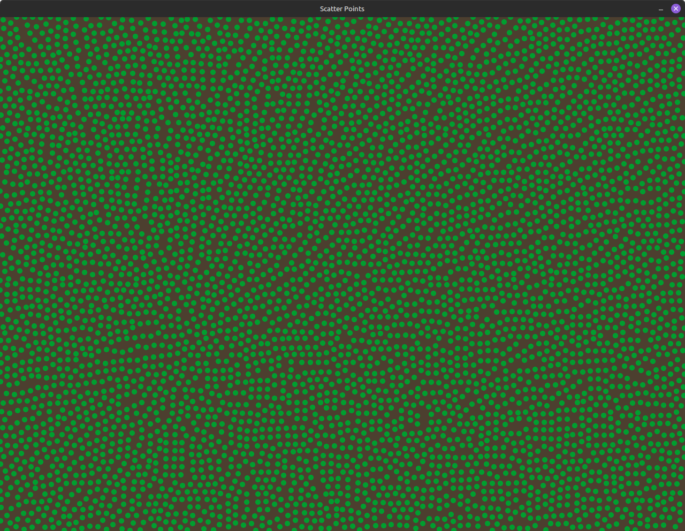

## Scatter Points

This is just a fun little project I wrote for practice.

It opens a window and covers the window in circles that are distributed randomly,
but never come within a minimum distance of each other.

This uses a Poisson Disk -like algorithm,
but cuts a few corners for better performance.

## Running Locally

You'll need the [Odin compiler](https://odin-lang.org/docs/install/) installed.

Then just run `odin run src` in the root directory.

While the program is running, you can clear and refill the space by pressing `Enter` or `Space`.
